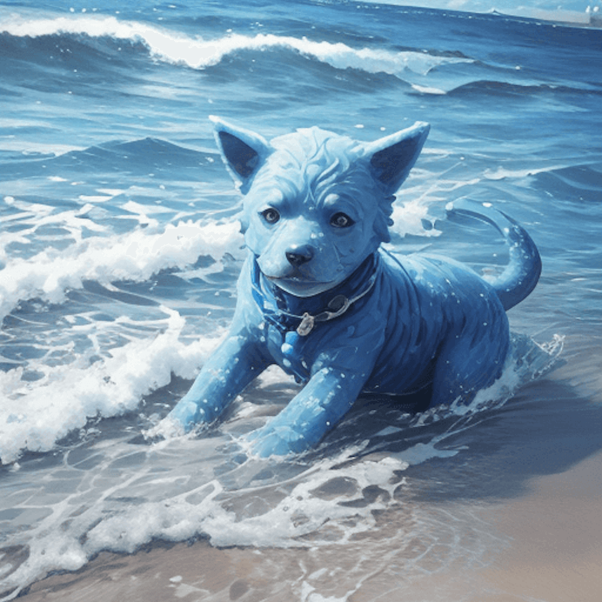
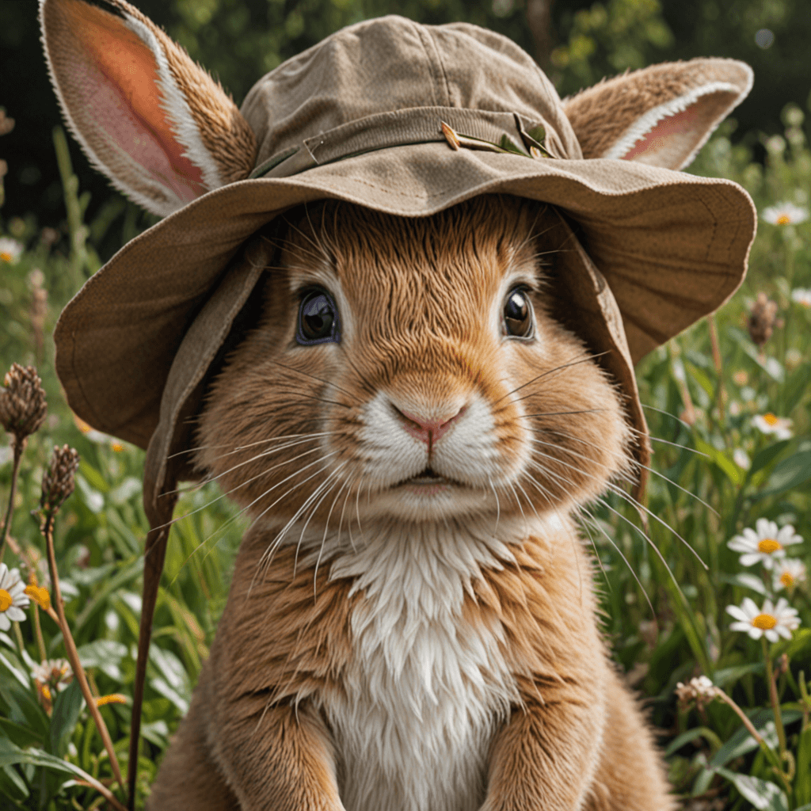
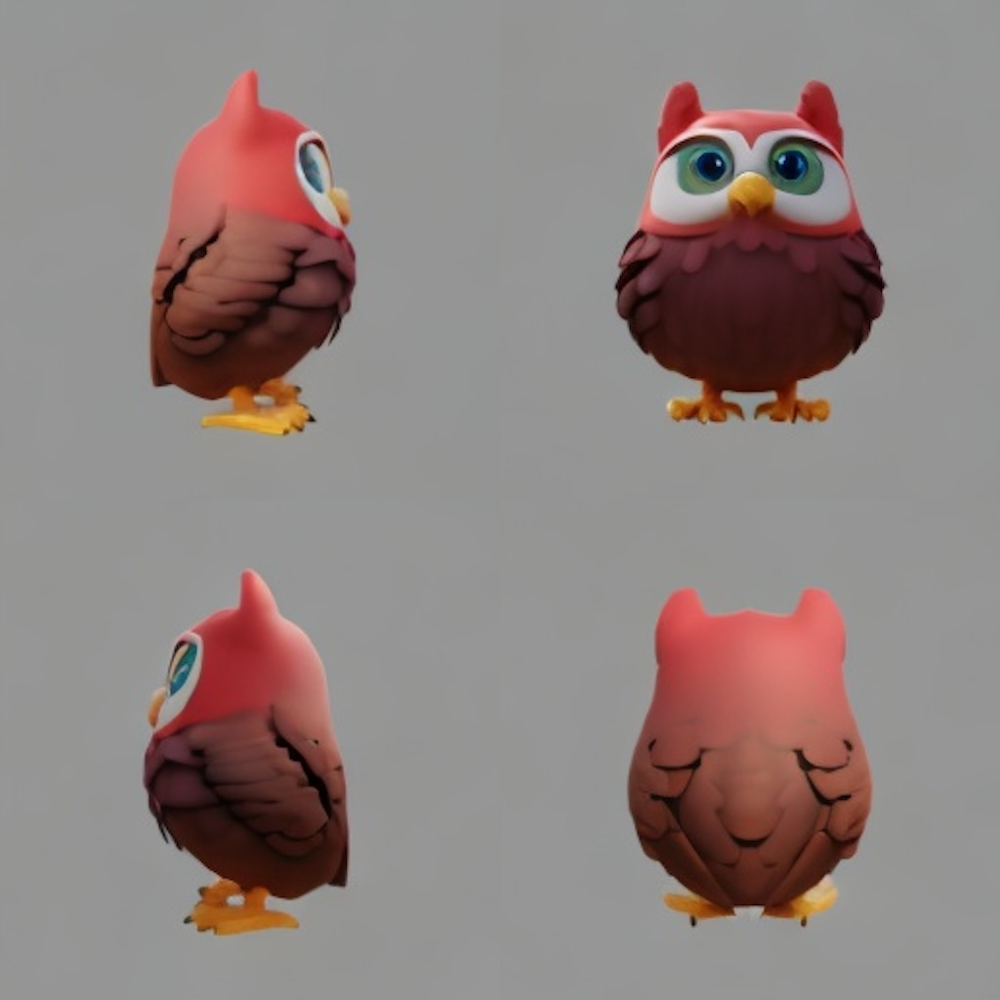
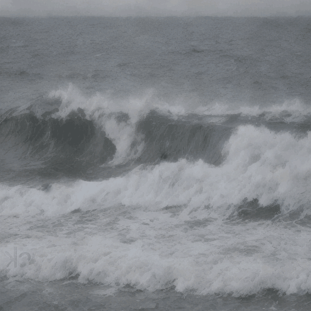

#  <div align="center"> 🌻 MuLan <div>

<div align="center">
<a href=# target="_blank"></a>
<a href=http://101.132.98.120:10025/  target="_blank"></a>
<!-- <a href=# target="_blank"></a> -->
<a href=https://huggingface.co/mulanai/mulan-lang-adapter target="_blank"></a>
<!-- <a href=https://github.com/mulanai/MuLan target="_blank"></a> -->
<a href="https://pypi.org/project/mulankit"></a>
</div>
<br>

```diff
# pip install mulankit
from diffusers import StableDiffusionPipeline
+ import mulankit

pipe = StableDiffusionPipeline.from_pretrained('Lykon/dreamshaper-8')
+ pipe = mulankit.transform(pipe, 'mulanai/mulan-lang-adapter::sd15_aesthetic.pth')
image = pipe('一只蓝色的🐶 in the 바다').images[0]
```

|一只蓝色的 🐶 in the 바다 (Dreamshaper-8)| レゴシュワルツェネッガー (SDXL-lightning)| 一只可爱的猫头鹰 (MVDream) | 海浪风景 (AnimateDiff) |
|--- | ---| --- | --- | 
| |  |  | |


## What is it ?

> We present **MuLan**, a versatile framework to equip any diffusion model with multilingual generation abilities natively by *up to 110+ languages* around the world. With properly trained text encoder from noisy data, we demonstrate that MuLan could be *trained on English only data* and support other languages *zero-shot*. Additionally, we introduce **Language Adapter**. A language adapter with *less than 20M parameters*, trained against a frozen denoiser and a text encoder, can be *readily combined with any homologous community models/tools*, such as LoRA, LCM, ControlNet, and IP-Adapter, *without any finetuning*.
> 
> MuLan(木兰）可以使任何扩散模型原生地支持多达110多种语言的图像/视频/3D生成能力。通过使用带噪声的海量数据适当训练的文本编码器，我们展示了MuLan可以仅在英语数据上进行训练并且支持其他语言的零样本生成。此外，我们引入了语言适配器。一个具有不到20M参数的简单映射网络，在一个冻结的去噪器和文本编码器上训练，即可无需任何微调地与任何同类社区模型/工具（如LoRA、LCM、ControlNet和IP-Adapter）无缝结合。


https://github.com/mulanai/MuLan/assets/26198430/611ea7ae-b1a8-4c14-8751-34b42175dcca


## News

- [ ] optimize memory usage.
- [ ] release technical report.
- [x] 2024-5-14: release code and models.


## How to use 

We have hosted a gradio demo [here](http://101.132.98.120:10025/).

MuLan supports 
- Base models: Stable Diffusion 1.5, 2.1, XL, Pixart-Alpha/Sigma.
- Downstream models: ControlNet, LCM, LoRA, finetuned models and etc.
- Video models: AnimateDiff.
- 3D models: MVDream.

Please refer to the [USAGE.md](USAGE.md) and [examples](examples/) for more details.


## Model Release

| Model                            | Description | Link                                                                       |
| -------------------------------- | ----|---------------------------------------------------------------------- |
| MuLan-Language-Adapter  | Adapters for SDXL, SD1.5/2.1, Pixart | [hf-model](https://huggingface.co/mulanai/mulan-lang-adapter)         |
| MuLan-Pixart | Full finetuned model | [hf-model](https://huggingface.co/mulanai/mulan-pixart) |

See more at our Huggingface 🌻 [Homepage](https://huggingface.co/mulanai).


## Citation

If you find this repo helpful, please considering citing us.

```bibtex
@article{lai2024mulan,
  title={MuLan: Adapting Multilingual Diffusion Models for 110 + Languages},
  year={2024}
}
```


## Acknowledgement

Our work is made possible by the open-source of these great works.

[Stable Diffusion](https://github.com/Stability-AI/stablediffusion) · [Pixart-Alpha](https://github.com/PixArt-alpha/PixArt-alpha) · [InternVL](https://github.com/OpenGVLab/InternVL) 

If you want to join our WeChat group, please scan the following QR Code to add our assistant as a Wechat friend:

<p align="center"></p>
